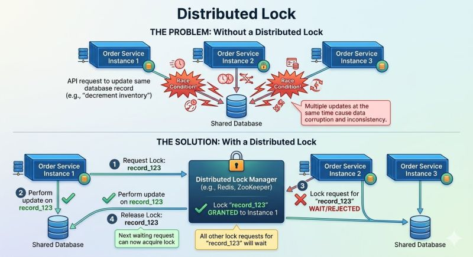

# Learning ShedLock


## Table of contents

1. [Stack](#stack)
2. [Why distributed locking?](#why-distributed-locking)
3. [ShedLock Concepts Demonstrated](#shedlock-concepts-demonstrated)
4. [Design Patterns](#design-patterns)
5. [ShedLock Table](#shedlock-table)
6. [Quick Start](#quick-start)
7. [Running Tests](#running-tests)
8. [ShedLock 7.7.0 Best Practices Applied](#shedlock-770-best-practices-applied)
9. [Maven Commands](#maven-commands)
10. [Key ShedLock Notes](#key-shedlock-notes)

Production-grade Spring Boot demonstration of **ShedLock** — distributed scheduler locking with JDBC/PostgreSQL, KeepAlive, programmatic locking, Flyway, Prometheus, and TestContainers.

## Stack

| Component          | Version / Detail                              |
|--------------------|-----------------------------------------------|
| Java               | 25                                            |
| Spring Boot        | 4.1.0 (via super-pom)                        |
| ShedLock           | 7.7.0                                         |
| Lock Provider      | JdbcTemplateLockProvider (PostgreSQL)         |
| Database           | PostgreSQL 16                                 |
| Migrations         | Flyway                                        |
| Observability      | Micrometer + Prometheus + Grafana             |
| Tests              | JUnit 5 + TestContainers + Awaitility         |
| Build              | Maven 3.9+                                    |

---

## Why distributed locking?



Run the same scheduled job on three instances of a service and every cron tick fires **three
times** against the shared database — race conditions, double-processing, corrupted state
(top half of the diagram). A **distributed lock manager** fixes it (bottom half): each
instance asks for a named lock before doing the work; exactly one is granted it, the others
skip or wait, and releasing the lock lets the next waiter proceed.

ShedLock is precisely this pattern specialized for schedulers: the lock lives in a store you
already have (JDBC table here; Redis, Mongo, ZooKeeper also supported), `lockAtMostFor`
bounds the lock if the holder dies, and `lockAtLeastFor` suppresses double-fires from clock
drift. Note ShedLock is a *scheduler* lock, not a general mutual-exclusion primitive — it
makes no fairness or queuing guarantees like a full lock manager.

## ShedLock Concepts Demonstrated

### 1. Standard `@SchedulerLock` (ReportScheduler)
```java
@Scheduled(cron = "0 */1 * * * *")
@SchedulerLock(name = "reportScheduler", lockAtMostFor = "30s", lockAtLeastFor = "10s")
public void runReportGeneration() { ... }
```
- Only one node executes per cron tick
- `LockAssert.assertLocked()` verifies lock ownership inside the task

### 2. KeepAliveLockProvider — Decorator Pattern (CleanupScheduler)
```java
@SchedulerLock(name = "cleanupScheduler", lockAtMostFor = "5m", lockAtLeastFor = "1m")
@LockProviderToUse("keepAliveLockProvider")
public void runDataCleanup() { ... }
```
- `KeepAliveLockProvider` wraps `JdbcTemplateLockProvider` (GoF Decorator)
- Refreshes the lock every `lockAtMostFor/2`, preventing premature expiry on long tasks
- Requires `lockAtMostFor >= 30s`

### 3. Programmatic Locking (CustomLockScheduler)
```java
Optional<SimpleLock> lock = lockProvider.lock(lockConfig);
if (lock.isEmpty()) return;  // another node holds it — skip
try {
    executeBusinessLogic();
} finally {
    lock.get().unlock();
}
```
- Full control over lock acquisition and release
- Non-blocking: skips execution if lock is unavailable

### 4. Cron Expressions (NotificationScheduler)
```
# Every 1 minute
0 */1 * * * *
# Disable a scheduler
shedlock.notification.cron=-
```

### 5. JdbcTemplateLockProvider Configuration
```java
JdbcTemplateLockProvider.Configuration.builder()
    .withJdbcTemplate(new JdbcTemplate(dataSource))
    .usingDbTime()        // use DB server clock — avoids cross-node clock skew
    .withTableName("shedlock")
    .build()
```

### 6. lockAtMostFor vs lockAtLeastFor
| Setting          | Purpose                                                        |
|------------------|----------------------------------------------------------------|
| `lockAtMostFor`  | Max lock hold time — prevents stuck locks if a node dies       |
| `lockAtLeastFor` | Min lock hold time — prevents race on the same cron tick       |
| `defaultLockAtMostFor` | @EnableSchedulerLock default applied when method doesn't specify |

### 7. Thread Pool for Schedulers
```java
@Bean
public ThreadPoolTaskScheduler taskScheduler() {
    ThreadPoolTaskScheduler scheduler = new ThreadPoolTaskScheduler();
    scheduler.setPoolSize(5);
    return scheduler;
}
```
Spring's default scheduler is single-threaded — custom pool allows parallel task execution.

---

## Design Patterns

| Pattern         | Where Applied                                                              |
|-----------------|----------------------------------------------------------------------------|
| Template Method | `AbstractScheduler` — skeleton with `LockAssert` + timing, delegates to `performTask()` |
| Decorator       | `KeepAliveLockProvider` wraps `JdbcTemplateLockProvider`                   |
| Strategy        | `LockProvider` interface — swap JDBC / Redis / InMemory without changing callers |
| Factory Method  | `createLockConfiguration()` in `CustomLockScheduler`                      |

---

## ShedLock Table

Created automatically by Flyway (`V1__create_shedlock_table.sql`):

```sql
CREATE TABLE shedlock (
    name       VARCHAR(64)  NOT NULL PRIMARY KEY,  -- scheduler name
    lock_until TIMESTAMP(3) NOT NULL,              -- when the lock expires
    locked_at  TIMESTAMP(3) NOT NULL,              -- when acquired
    locked_by  VARCHAR(255) NOT NULL               -- hostname:port of the holder
);
```

---

## Quick Start

### 1. Start infrastructure
```bash
docker-compose up -d
```

### 2. Run the application
```bash
./mvnw spring-boot:run
```

### 3. Open dashboards
| URL                         | Description               |
|-----------------------------|---------------------------|
| http://localhost:8080/actuator | Actuator endpoints      |
| http://localhost:8080/actuator/info | ShedLock table state |
| http://localhost:8080/api/v1/schedulers | Scheduler metadata |
| http://localhost:8080/api/v1/schedulers/locks | Live lock records |
| http://localhost:9091       | Prometheus                |
| http://localhost:3001       | Grafana (admin/admin)     |

---

## Running Tests

```bash
./mvnw test
```

Tests use TestContainers to spin up a real PostgreSQL container — no manual setup required.

---

## ShedLock 7.7.0 Best Practices Applied

### 1. `MicrometerLockingTaskExecutorListener` — Lock metrics via Micrometer
Registered in `ShedlockConfig` and wired into `DefaultLockingTaskExecutor`. Publishes 5 meters per lock name to Prometheus:

| Meter | Description |
|-------|-------------|
| `shedlock.lock.attempts` | Total acquisition attempts |
| `shedlock.lock.acquired` | Successful acquisitions |
| `shedlock.lock.not.acquired` | Skipped — lock already held |
| `shedlock.execution.duration` | Time spent inside the locked task |
| `shedlock.execution.active` | Currently running locked tasks |

`registerMetricsFor()` pre-creates all gauges at startup so they appear in Prometheus before first execution.

### 2. `LockingTaskExecutor` for programmatic locking
`CustomLockScheduler` now uses `DefaultLockingTaskExecutor.executeWithLock()` instead of raw `LockProvider.lock()`. Unlock is guaranteed automatically — no risk of a missed `finally` block. Integrates with the Micrometer listener automatically.

### 3. `LockExtender.extendActiveLock()` — Runtime lock extension
`CleanupScheduler.performTask()` calls `LockExtender.extendActiveLock(Duration.ofMinutes(10), Duration.ZERO)` when a large dataset is detected at runtime. Use when the task itself knows it needs more time than initially estimated.

```
KeepAliveLockProvider  → automatic background renewal (set-and-forget)
LockExtender           → manual call when runtime state demands more time
```

### 4. `@SchedulerLock` durations driven by properties
All `@SchedulerLock` annotations use `${shedlock.<name>.lock-at-most-for}` Spring property placeholders. Durations are configured once in `application.yml` — no hardcoded values in annotations.

### 5. `LockNames` constants
`config/LockNames.java` centralises all lock name strings. Used in `ShedlockConfig`, `ShedlockInfoContributor`, and `SchedulerController` to prevent typos across multiple files. Annotations use property placeholders (`${shedlock.report.lock-name:reportScheduler}`) for the same reason.

### 6. `lock_until` index
`V2__add_shedlock_index.sql` adds `CREATE INDEX idx_shedlock_lock_until ON shedlock (lock_until)`. ShedLock filters expired locks on this column — without the index each query is a sequential scan.

### 7. Explicit `AopMode.PROXY_METHOD`
`@EnableSchedulerLock(mode = AopMode.PROXY_METHOD)` — states the AOP mode explicitly. Prevents silent failures if another AOP proxy (e.g. `@Transactional`) is added later and changes the proxy order.

### 8. Integration tests for all schedulers

| Test class | What it verifies |
|-----------|-----------------|
| `ReportSchedulerIT` | Lock record created, `LockAssert` in test mode |
| `CleanupSchedulerIT` | Lock record created; `lock_until` in future (KeepAlive proof) |
| `NotificationSchedulerIT` | Lock record created; `cron = "-"` disable pattern |
| `CustomLockSchedulerIT` | Lock record created; **skips** when another node holds the lock |

### 9. ANSI log colours (`spring.output.ansi.enabled: always`)
`%clr(...)` in `logback-spring.xml` requires Spring Boot's `AnsiOutput`. Default mode is `DETECT` which fails in IDEs and piped output. Setting `always` forces colours on unconditionally.

---

## Maven Commands

| Command | Description |
|---------|-------------|
| `./mvnw spring-boot:run` | Start the application |
| `./mvnw test` | Run all tests (spins up PostgreSQL via TestContainers) |
| `./mvnw clean install` | Clean build and install to local repository |
| `./mvnw dependency:resolve` | Resolve and download all declared dependencies |
| `./mvnw dependency:tree` | Print the full dependency tree |
| `./mvnw flyway:info` | Show applied and pending migrations |
| `./mvnw flyway:repair -Dflyway.url=jdbc:postgresql://localhost:5432/<db> -Dflyway.user=<user> -Dflyway.password=<pass>` | Fix checksum mismatches after a migration file is edited post-apply |
| `./mvnw flyway:clean -Dflyway.url=jdbc:postgresql://localhost:5432/<db> -Dflyway.user=<user> -Dflyway.password=<pass>` | Drop all objects in the schema (dev only) |

---

## Key ShedLock Notes

> **IMPORTANT**: If ShedLock fails to start (e.g. DB unavailable), **none of the schedulers will start** and no logs will be written. Always ensure the database is healthy before starting the application.

- Locked by value format: `hostname:port` (auto-generated, unique per node)
- `lockAtMostFor` is your safety net for crashed nodes
- Use `usingDbTime()` in multi-AZ deployments where server clocks may drift
- `@LockProviderToUse` selects a specific `LockProvider` bean when multiple are defined
