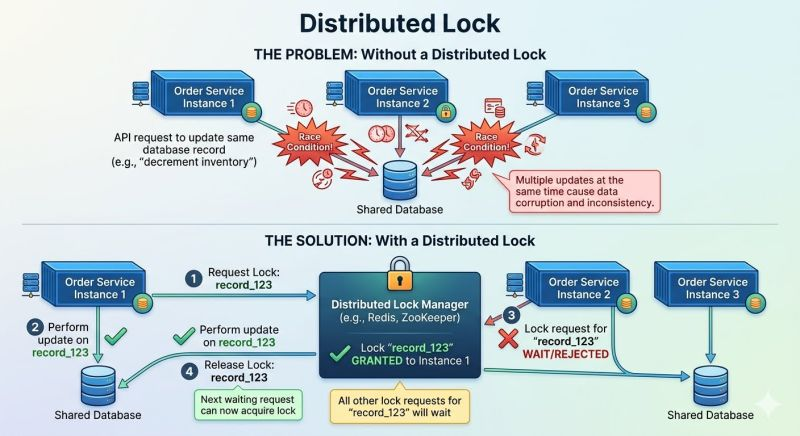
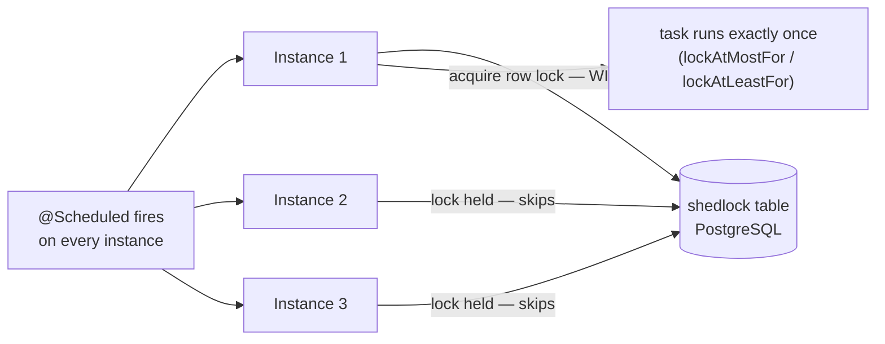
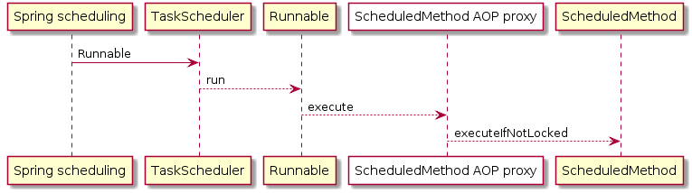

# <span style="color:hsl(3,80%,58%)">Learning ShedLock</span>

## <span style="color:hsl(141,80%,58%)">Table of contents</span>

1. 🧰 [Stack](#stack)
2. ⏰ [Why distributed locking?](#why-distributed-locking)
3. ⏰ [ShedLock Concepts Demonstrated](#shedlock-concepts-demonstrated)
4. 🏗️ [Design Patterns](#design-patterns)
5. 🗄️ [ShedLock Table](#shedlock-table)
6. 🚀 [Quick Start](#quick-start)
7. 🧪 [Running Tests](#running-tests)
8. ⏰ [ShedLock 7.10 Best Practices Applied](#shedlock-710-best-practices-applied)
9. 🔨 [Maven Commands](#maven-commands)
10. ⏰ [Key ShedLock Notes](#key-shedlock-notes)

Production-grade Spring Boot demonstration of **ShedLock** — distributed scheduler locking with JDBC/PostgreSQL, KeepAlive, programmatic locking, Flyway, Prometheus, and Testcontainers.

<a id="stack"></a>
## <span style="color:hsl(278,80%,58%)">1. 🧰 Stack</span>

| Component     | Version / Detail                                         |
|---------------|----------------------------------------------------------|
| Java          | 27                                                       |
| Spring Boot   | 4.1.1 (via super-pom 1.2.0, as of 2026)                  |
| ShedLock      | 7.10.1 (as of 2026)                                      |
| Lock Provider | JdbcTemplateLockProvider (PostgreSQL)                    |
| Database      | PostgreSQL 19beta1 (Docker Compose), 18 (Testcontainers) |
| Migrations    | Flyway                                                   |
| Observability | Micrometer + Prometheus + Grafana                        |
| Tests         | JUnit 6 + Testcontainers 2 + Awaitility                  |
| Build         | Maven 3.9+                                               |

---

<a id="why-distributed-locking"></a>
## <span style="color:hsl(56,80%,50%)">2. ⏰ Why distributed locking?</span>




```mermaid
flowchart LR
    cron["@Scheduled fires<br/>on every instance"] --> i1[Instance 1]
    cron --> i2[Instance 2]
    cron --> i3[Instance 3]
    i1 -->|"acquire row lock — WINS"| lock[("shedlock table<br/>PostgreSQL")]
    i2 -->|"lock held — skips"| lock
    i3 -->|"lock held — skips"| lock
    i1 --> task["task runs exactly once<br/>(lockAtMostFor / lockAtLeastFor)"]
```

Run the same scheduled job on three instances of a service and every cron tick fires **three
times** against the shared database — race conditions, double-processing, corrupted state
(top half of the diagram). A **distributed lock manager** fixes it (bottom half): each
instance asks for a named lock before doing the work; exactly one is granted it, the others
skip or wait, and releasing the lock lets the next waiter proceed.

ShedLock is precisely this pattern specialized for schedulers: the lock lives in a store you
already have (JDBC table here; Redis, Mongo, ZooKeeper also supported), `lockAtMostFor`
bounds the lock if the holder dies, and `lockAtLeastFor` suppresses double-fires from clock
drift. Note ShedLock is a *scheduler* lock, not a general mutual-exclusion primitive — it
makes no fairness or queuing guarantees like a full lock manager.

<a id="shedlock-concepts-demonstrated"></a>
## <span style="color:hsl(193,80%,58%)">3. ⏰ ShedLock Concepts Demonstrated</span>

### <span style="color:hsl(331,80%,58%)">1. Standard `@SchedulerLock` (ReportScheduler)</span>
```java
@Scheduled(cron = "0 */1 * * * *")
@SchedulerLock(name = "reportScheduler", lockAtMostFor = "30s", lockAtLeastFor = "10s")
public void runReportGeneration() { ... }
```

<ul>

- Only one node executes per cron tick
- [`LockAssert.assertLocked()`][LockAssert] verifies lock ownership inside the task

</ul>

### <span style="color:hsl(108,80%,58%)">2. KeepAliveLockProvider — Decorator Pattern (CleanupScheduler)</span>
```java
@SchedulerLock(name = "cleanupScheduler", lockAtMostFor = "5m", lockAtLeastFor = "1m")
@LockProviderToUse("keepAliveLockProvider")
public void runDataCleanup() { ... }
```

<ul>

- [`KeepAliveLockProvider`][KeepAliveLockProvider] wraps [`JdbcTemplateLockProvider`][JdbcTemplateLockProvider] (GoF Decorator)
- Refreshes the lock every `lockAtMostFor/2`, preventing premature expiry on long tasks
- Requires `lockAtMostFor >= 30s`
- Its locks can't be extended by hand: [`LockExtender`][LockExtender] throws [`UnsupportedOperationException`][UnsupportedOperationException] under it ([§8.3](#shedlock-710-best-practices-applied))

</ul>

### <span style="color:hsl(246,80%,58%)">3. Programmatic Locking (CustomLockScheduler)</span>
```java
lockingTaskExecutor.executeWithLock(
        (LockingTaskExecutor.Task) this::executeBusinessLogic,
        new LockConfiguration(Instant.now(), "customLockScheduler", lockAtMostFor, lockAtLeastFor));
```

<ul>

- [`LockingTaskExecutor`][LockingTaskExecutor] acquires the lock, runs the task and always releases it — no `finally` block to forget
- Non-blocking: skips execution if lock is unavailable

</ul>

### <span style="color:hsl(23,80%,58%)">4. Cron Expressions (NotificationScheduler)</span>
```
# Every 1 minute
0 */1 * * * *
# Disable a scheduler
shedlock.notification.cron=-
```
`-` is [`Scheduled.CRON_DISABLED`][Scheduled]: Spring never registers the task. Spring's cron has exactly six fields (no year), so Quartz-style far-future dates such as `59 59 23 31 12 ? 2099` fail at startup.

### <span style="color:hsl(161,80%,58%)">5. JdbcTemplateLockProvider Configuration</span>
```java
JdbcTemplateLockProvider.Configuration.builder()
    .withJdbcTemplate(new JdbcTemplate(dataSource))
    .usingDbTime()        // use DB server clock — avoids cross-node clock skew
    .withTableName("shedlock")
    .build()
```

### <span style="color:hsl(298,80%,58%)">6. lockAtMostFor vs lockAtLeastFor</span>
| Setting                | Purpose                                                          |
|------------------------|------------------------------------------------------------------|
| `lockAtMostFor`        | Max lock hold time — prevents stuck locks if a node dies         |
| `lockAtLeastFor`       | Min lock hold time — prevents race on the same cron tick         |
| `defaultLockAtMostFor` | @EnableSchedulerLock default applied when method doesn't specify |

### <span style="color:hsl(76,80%,58%)">7. Thread Pool for Schedulers</span>
```java
@Bean
public ThreadPoolTaskScheduler taskScheduler() {
    ThreadPoolTaskScheduler scheduler = new ThreadPoolTaskScheduler();
    scheduler.setPoolSize(5);
    return scheduler;
}
```
Spring Boot's default scheduler is a [`ThreadPoolTaskScheduler`][ThreadPoolTaskScheduler] with one thread (`spring.task.scheduling.pool.size=1`), so one slow job delays the others. With `spring.threads.virtual.enabled: true`, as in this app's `application.yml`, Boot would use a [`SimpleAsyncTaskScheduler`][SimpleAsyncTaskScheduler] on virtual threads instead. Defining the `taskScheduler` bean replaces both: the jobs here run on five `shedlock-scheduler-*` threads.

---

<a id="design-patterns"></a>
## <span style="color:hsl(213,80%,58%)">4. 🏗️ Design Patterns</span>

| Pattern         | Where Applied                                                                                                 |
|-----------------|---------------------------------------------------------------------------------------------------------------|
| Template Method | `AbstractScheduler` — skeleton with [`LockAssert`][LockAssert] + timing, delegates to `performTask()`         |
| Decorator       | [`KeepAliveLockProvider`][KeepAliveLockProvider] wraps [`JdbcTemplateLockProvider`][JdbcTemplateLockProvider] |
| Strategy        | [`LockProvider`][LockProvider] interface — swap JDBC / Redis / InMemory without changing callers              |
| Factory Method  | `createLockConfiguration()` in `CustomLockScheduler`                                                          |

---

<a id="shedlock-table"></a>
## <span style="color:hsl(351,80%,58%)">5. 🗄️ ShedLock Table</span>

Created automatically by Flyway (`V1__create_shedlock_table.sql`):

```sql
CREATE TABLE shedlock (
    name       VARCHAR(64)  NOT NULL PRIMARY KEY,  -- scheduler name
    lock_until TIMESTAMP(3) NOT NULL,              -- when the lock expires
    locked_at  TIMESTAMP(3) NOT NULL,              -- when acquired
    locked_by  VARCHAR(255) NOT NULL               -- host name of the holder (ShedLock's default)
);
```

The primary key on `name` is the only index ShedLock needs: every statement it runs finds the row by name. `V2__add_shedlock_index.sql` once added an index on `lock_until`; `V3__drop_shedlock_lock_until_index.sql` drops it again ([§8.6](#shedlock-710-best-practices-applied)).

---

<a id="quick-start"></a>
## <span style="color:hsl(128,80%,58%)">6. 🚀 Quick Start</span>

### <span style="color:hsl(266,80%,58%)">1. Start infrastructure</span>
```bash
docker compose up -d
```

### <span style="color:hsl(43,80%,58%)">2. Run the application</span>
```bash
mvn spring-boot:run
```

### <span style="color:hsl(181,80%,58%)">3. Open dashboards</span>
| URL                                           | Description           |
|-----------------------------------------------|-----------------------|
| http://localhost:8080/actuator                | Actuator endpoints    |
| http://localhost:8080/actuator/info           | ShedLock table state  |
| http://localhost:8080/api/v1/schedulers       | Scheduler metadata    |
| http://localhost:8080/api/v1/schedulers/locks | Live lock records     |
| http://localhost:9091                         | Prometheus            |
| http://localhost:3001                         | Grafana (admin/admin) |

---

<a id="running-tests"></a>
## <span style="color:hsl(318,80%,58%)">7. 🧪 Running Tests</span>

```bash
mvn verify   # `mvn test` runs only surefire; the *IT classes run in failsafe's integration-test phase
```

Tests use Testcontainers to spin up **one** PostgreSQL container shared by every test class (`support/AbstractPostgresIT`) — no manual setup required. A per-class [`@Container`][Container] would be stopped while Spring's cached contexts (and their [`@Scheduled`][Scheduled] jobs) are still alive, which hangs JVM shutdown.

Failsafe runs the ITs with `TZ=America/New_York`. `lock_until` holds UTC wall-clock time, and a zone west of UTC makes any time-zone mix-up fail on CI, which runs in UTC, and not only on developer machines.

---

<a id="shedlock-710-best-practices-applied"></a>
## <span style="color:hsl(96,80%,58%)">8. ⏰ ShedLock 7.10 Best Practices Applied</span>

### <span style="color:hsl(233,80%,58%)">1. `MicrometerLockingTaskExecutorListener` — Lock metrics via Micrometer</span>
Registered in `ShedlockConfig` and wired into [`DefaultLockingTaskExecutor`][DefaultLockingTaskExecutor]. ShedLock's [`@SchedulerLock`][SchedulerLock] advisor picks up the same listener bean, so the annotated schedulers are measured too, not only the programmatic one. Publishes 5 meters per lock name to Prometheus:

| Meter                         | Description                       |
|-------------------------------|-----------------------------------|
| `shedlock.lock.attempts`      | Total acquisition attempts        |
| `shedlock.lock.acquired`      | Successful acquisitions           |
| `shedlock.lock.not.acquired`  | Skipped — lock already held       |
| `shedlock.execution.duration` | Time spent inside the locked task |
| `shedlock.execution.active`   | Currently running locked tasks    |

`registerMetricsFor()` pre-creates all gauges at startup so they appear in Prometheus before first execution.

### <span style="color:hsl(11,80%,58%)">2. `LockingTaskExecutor` for programmatic locking</span>
`CustomLockScheduler` now uses [`DefaultLockingTaskExecutor.executeWithLock()`][DefaultLockingTaskExecutor] instead of raw [`LockProvider.lock()`][LockProvider]. Unlock is guaranteed automatically — no risk of a missed `finally` block. Integrates with the Micrometer listener automatically.

### <span style="color:hsl(148,80%,58%)">3. `LockExtender.extendActiveLock()` — Runtime lock extension</span>
`ReportScheduler.performTask()` calls [`LockExtender.extendActiveLock(Duration.ofMinutes(10), Duration.ZERO)`][LockExtender] when a large report is detected at runtime. Use when the task itself knows it needs more time than initially estimated.

It only works on locks that can be extended, such as the JDBC provider's. Under [`KeepAliveLockProvider`][KeepAliveLockProvider] it throws [`UnsupportedOperationException`][UnsupportedOperationException] ("Manual extension of KeepAliveLock is not supported"), so the KeepAlive-locked `CleanupScheduler` leaves the renewal to KeepAlive. `LockExtenderIT` shows both cases.

```
KeepAliveLockProvider  → automatic background renewal (set-and-forget)
LockExtender           → manual call when runtime state demands more time (not under KeepAlive)
```

### <span style="color:hsl(286,80%,58%)">4. `@SchedulerLock` durations driven by properties</span>
All `@SchedulerLock` annotations use `${shedlock.<name>.lock-at-most-for}` Spring property placeholders. Durations are configured once in `application.yml` — no hardcoded values in annotations.

### <span style="color:hsl(63,80%,50%)">5. `LockNames` constants</span>
`config/LockNames.java` holds the default lock names; `ShedlockConfig` uses them to pre-register the Micrometer meters. The annotations read the name from a property placeholder whose default is the same string (`${shedlock.report.lock-name:reportScheduler}`), and `SchedulerController` reports the configured names from `ShedlockProperties`.

### <span style="color:hsl(201,80%,58%)">6. No `lock_until` index</span>
`V2__add_shedlock_index.sql` added `CREATE INDEX idx_shedlock_lock_until ON shedlock (lock_until)`, on the theory that ShedLock filters expired locks on this column. It doesn't need the index: every statement ShedLock runs (insert-on-conflict, update, extend, unlock) finds the row by `name`, the primary key, and only then compares `lock_until`.

The index cost more than it saved. `lock_until` changes on every lock and unlock, and an index on a changed column rules out PostgreSQL's HOT (heap-only tuple) updates, so each update also wrote a new index entry and left more bloat behind. In a quick test on PostgreSQL 18, 0 of 500 `lock_until` updates were HOT with the index, and 496 of 500 without it. `V3__drop_shedlock_lock_until_index.sql` drops the index. V2 stays as it was, so Flyway's checksum still matches on databases that already applied it.

### <span style="color:hsl(338,80%,58%)">7. Explicit `InterceptMode.PROXY_METHOD`</span>
[`@EnableSchedulerLock(interceptMode = InterceptMode.PROXY_METHOD)`][EnableSchedulerLock] — states the AOP mode explicitly. Prevents silent failures if another AOP proxy (e.g. [`@Transactional`][Transactional]) is added later and changes the proxy order.

<p align="center">
  
</p>

<p align="center"><sub>With <code>PROXY_METHOD</code> the lock is taken by an AOP proxy around the <code>@SchedulerLock</code> method itself, so the method is locked however it is invoked. Diagram: <a href="https://github.com/lukas-krecan/ShedLock#modes-of-spring-integration">ShedLock — Modes of Spring integration</a>, Apache-2.0.</sub></p>

### <span style="color:hsl(116,80%,58%)">8. Integration tests for all schedulers</span>

| Test class                      | What it verifies                                                                                                   |
|---------------------------------|--------------------------------------------------------------------------------------------------------------------|
| `ReportSchedulerIT`             | Lock records created, [`LockAssert`][LockAssert] in test mode, only the primary-key index, Micrometer lock metrics |
| `CleanupSchedulerIT`            | Lock record created; `lock_until` in future (KeepAlive proof)                                                      |
| `NotificationSchedulerIT`       | Lock record created; `lock_until` set                                                                              |
| `NotificationSchedulerCronTest` | `cron = "-"` leaves the job unregistered; a cron expression registers it                                           |
| `CustomLockSchedulerIT`         | Lock record created; **skips** when another node holds the lock                                                    |
| `LockExtenderIT`                | `LockExtender` extends a JDBC lock and is rejected under KeepAlive                                                 |
| `SchedulerControllerIT`         | `/api/v1/schedulers` follows the configuration; lock times are the right instants                                  |
| `ShedlockInfoContributorTest`   | `/actuator/info` copes with an exception that has no message                                                       |

### <span style="color:hsl(253,80%,58%)">9. ANSI log colours (`spring.output.ansi.enabled: always`)</span>
`%clr(...)` in `logback-spring.xml` requires Spring Boot's [`AnsiOutput`][AnsiOutput]. Default mode is `DETECT` which fails in IDEs and piped output. Setting `always` forces colours on unconditionally.

---

<a id="maven-commands"></a>
## <span style="color:hsl(31,80%,58%)">9. 🔨 Maven Commands</span>

| Command                                                                                                                                                     | Description                                                                                    |
|-------------------------------------------------------------------------------------------------------------------------------------------------------------|------------------------------------------------------------------------------------------------|
| `mvn spring-boot:run`                                                                                                                                       | Start the application                                                                          |
| `mvn verify`                                                                                                                                                | Run unit + integration tests (spins up PostgreSQL via Testcontainers)                          |
| `mvn clean install`                                                                                                                                         | Clean build and install to local repository                                                    |
| `mvn dependency:resolve`                                                                                                                                    | Resolve and download all declared dependencies                                                 |
| `mvn dependency:tree`                                                                                                                                       | Print the full dependency tree                                                                 |
| `mvn flyway:info -Dflyway.url=jdbc:postgresql://localhost:5433/shedlock_db -Dflyway.user=shedlock -Dflyway.password=shedlock`                               | Show applied and pending migrations (connection settings of the compose database)              |
| `mvn flyway:repair -Dflyway.url=jdbc:postgresql://localhost:5433/shedlock_db -Dflyway.user=shedlock -Dflyway.password=shedlock`                             | Fix checksum mismatches after a migration file is edited post-apply                            |
| `mvn flyway:clean -Dflyway.cleanDisabled=false -Dflyway.url=jdbc:postgresql://localhost:5433/shedlock_db -Dflyway.user=shedlock -Dflyway.password=shedlock` | Drop all objects in the schema (dev only; Flyway refuses `clean` unless `cleanDisabled=false`) |

---

<a id="key-shedlock-notes"></a>
## <span style="color:hsl(168,80%,58%)">10. ⏰ Key ShedLock Notes</span>

> **IMPORTANT**: If the database is unreachable at startup, the Flyway migration fails and **the application doesn't start at all**, so start PostgreSQL first (`docker compose up -d`) and let its health check pass. If the database goes away while the app runs, each job's lock attempt fails: that run is skipped and logged, and the next tick tries again.

<ul>

- `locked_by` defaults to the host name, so two instances on one machine write the same value; [`JdbcTemplateLockProvider.Configuration.builder().withLockedByValue(...)`][JdbcTemplateLockProvider] sets your own
- `lockAtMostFor` is your safety net for crashed nodes
- Use `usingDbTime()` in multi-AZ deployments where server clocks may drift
- [`@LockProviderToUse`][LockProviderToUse] selects a specific [`LockProvider`][LockProvider] bean when multiple are defined

</ul>

<!-- Library classes mentioned above, linked to their source at the versions this project builds with. -->

[AnsiOutput]: https://github.com/spring-projects/spring-boot/blob/v4.1.1/core/spring-boot/src/main/java/org/springframework/boot/ansi/AnsiOutput.java
[Container]: https://github.com/testcontainers/testcontainers-java/blob/2.0.5/modules/junit-jupiter/src/main/java/org/testcontainers/junit/jupiter/Container.java
[DefaultLockingTaskExecutor]: https://github.com/lukas-krecan/ShedLock/blob/shedlock-parent-7.10.1/shedlock-core/src/main/java/net/javacrumbs/shedlock/core/DefaultLockingTaskExecutor.java
[EnableSchedulerLock]: https://github.com/lukas-krecan/ShedLock/blob/shedlock-parent-7.10.1/spring/shedlock-spring/src/main/java/net/javacrumbs/shedlock/spring/annotation/EnableSchedulerLock.java
[JdbcTemplateLockProvider]: https://github.com/lukas-krecan/ShedLock/blob/shedlock-parent-7.10.1/providers/jdbc/shedlock-provider-jdbc-template/src/main/java/net/javacrumbs/shedlock/provider/jdbctemplate/JdbcTemplateLockProvider.java
[KeepAliveLockProvider]: https://github.com/lukas-krecan/ShedLock/blob/shedlock-parent-7.10.1/shedlock-core/src/main/java/net/javacrumbs/shedlock/support/KeepAliveLockProvider.java
[LockAssert]: https://github.com/lukas-krecan/ShedLock/blob/shedlock-parent-7.10.1/shedlock-core/src/main/java/net/javacrumbs/shedlock/core/LockAssert.java
[LockExtender]: https://github.com/lukas-krecan/ShedLock/blob/shedlock-parent-7.10.1/shedlock-core/src/main/java/net/javacrumbs/shedlock/core/LockExtender.java
[LockingTaskExecutor]: https://github.com/lukas-krecan/ShedLock/blob/shedlock-parent-7.10.1/shedlock-core/src/main/java/net/javacrumbs/shedlock/core/LockingTaskExecutor.java
[LockProvider]: https://github.com/lukas-krecan/ShedLock/blob/shedlock-parent-7.10.1/shedlock-core/src/main/java/net/javacrumbs/shedlock/core/LockProvider.java
[LockProviderToUse]: https://github.com/lukas-krecan/ShedLock/blob/shedlock-parent-7.10.1/spring/shedlock-spring/src/main/java/net/javacrumbs/shedlock/spring/annotation/LockProviderToUse.java
[Scheduled]: https://github.com/spring-projects/spring-framework/blob/v7.0.9/spring-context/src/main/java/org/springframework/scheduling/annotation/Scheduled.java
[SchedulerLock]: https://github.com/lukas-krecan/ShedLock/blob/shedlock-parent-7.10.1/spring/shedlock-spring/src/main/java/net/javacrumbs/shedlock/spring/annotation/SchedulerLock.java
[SimpleAsyncTaskScheduler]: https://github.com/spring-projects/spring-framework/blob/v7.0.9/spring-context/src/main/java/org/springframework/scheduling/concurrent/SimpleAsyncTaskScheduler.java
[ThreadPoolTaskScheduler]: https://github.com/spring-projects/spring-framework/blob/v7.0.9/spring-context/src/main/java/org/springframework/scheduling/concurrent/ThreadPoolTaskScheduler.java
[Transactional]: https://github.com/spring-projects/spring-framework/blob/v7.0.9/spring-tx/src/main/java/org/springframework/transaction/annotation/Transactional.java
[UnsupportedOperationException]: https://github.com/openjdk/jdk/blob/jdk-27-ga/src/java.base/share/classes/java/lang/UnsupportedOperationException.java
